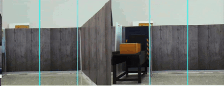
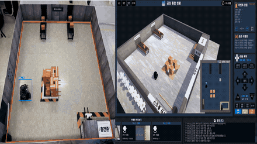

# TurtleBot3 AI Safety Patrol

터틀봇 기반 AI 안전·인력관리 자율주행 로봇 시스템.
TurtleBot3 3대가 물류센터를 무인 순찰하며, AI가 위험(화재·쓰러짐·안전모 미착용)을 감지하면
로봇이 현장에 출동해 증거를 촬영하고, 배터리가 부족하면 스스로 충전·교대하는 시스템입니다.

5인 팀 프로젝트에서 **자율주행(SLAM & Navigation) 파트와 하드웨어 확장을 담당**했습니다.
이 저장소는 담당 파트의 코드·문서이며, 전체 시스템(AI 인식, 서버/DB, Unity 관제)은
팀 저장소에 있습니다: [eduwing-robotics/ros2-ai-amr-repo4](https://github.com/eduwing-robotics/ros2-ai-amr-repo4)

<div align="center">
  <a href="docs/videos/홍보영상.mp4">
    
  </a>
  <br><em>▶ 프로젝트 홍보 영상 (3분 18초) — 이미지를 클릭하면 재생됩니다</em>
</div>

## 최종 성과

| 항목 | 결과 | 비고 |
|---|---|---|
| 주행 성공률 | 30% → **100%** | 원인은 주행 코드가 아니라 시간동기(chrony) |
| 도킹 반복 정밀도 | **±2mm** / 진입각 -0.23° | ArUco 접근 + 라이다 벽피팅 자세 + 라이다 절대거리 |
| 금지구역 침범 | **0건** | KeepoutFilter + 자작 침범 감시 노드로 실기 검증 |
| 2대 자동 교대 | 개입 0회 | 1랩 = 1교대, 배터리 33%/85% 정책 |
| 검증 체크리스트 | 45항목 구현·검증 | 파트 간 인터페이스 계약 v1.4 기준 |

## 시연 장면

<table align="center">
  <tr>
    <td align="center" width="50%">
      <br>
      <sub><b>이벤트 감지 순간 (로봇 시점)</b> — 화재 FIRE 61% · 쓰러짐 FALL 87% (2.5배속)</sub>
    </td>
    <td align="center" width="50%">
      <br>
      <sub><b>출동 전체 흐름</b> — 순찰 → 이벤트 출동 → 복귀 (32배속 타임랩스)</sub>
    </td>
  </tr>
  <tr>
    <td align="center" width="50%">
      <br>
      <sub><b>정상 순찰 풀랩</b> — 순찰 후 충전 복귀 (10배속)</sub>
    </td>
    <td align="center" width="50%">
      <br>
      <sub><b>충전 교대</b> — 근접 경보(0.33m) 속 교차, 한 대는 충전존·한 대는 순찰 인계</sub>
    </td>
  </tr>
  <tr>
    <td align="center" width="50%">
      <br>
      <sub><b>자동 충전 도킹</b> — 반복 정밀도 ±2mm, 진입각 -0.23°</sub>
    </td>
    <td align="center" width="50%">
      <br>
      <sub><b>지게차 리프트 (3호기)</b> — 상자 운반 풀사이클 (16배속, 상세는 <a href="hardware/forklift_lift/">hardware/forklift_lift</a>)</sub>
    </td>
  </tr>
</table>

## 담당한 것

- **순찰 미션 제어** — rclpy 기반 `patrol_commander` 20상태 FSM 설계·구현 (순찰/파견/충전/비상)
- **정밀 도킹** — 지도 해상도 5cm 환경에서 mm 단위 충전 단자 정렬 (접근=ArUco, 자세=라이다 벽피팅, 깊이=라이다 절대거리)
- **이벤트 출동** — AI 감지 좌표로 출동, 폐루프 비주얼 서보잉으로 증거 사진 촬영 (60cm·±2°·수평 기준)
- **무인 운영** — 배터리 정책 기반 자동 충전·2대 교대, 로봇별 DDS 도메인 분리(97/88/4)
- **안전 설계** — E-STOP 래치, 스캔 두절 감시, 데드맨, 금지구역 침범 감시
- **하드웨어 확장** — 지게차 리프트(3D 프린팅 랙앤피니언+서보, 관제 연동), 마그네틱 포고핀 충전 단자

## 시스템 구성

```
Cartographer(SLAM) → AMCL(위치추정) → NavFn + RPP(경로계획·조향)
                                          │
                     patrol_commander (20상태 FSM) ← 서버/관제 명령
                                          │
              순찰 · 이벤트 출동 · 충전 복귀 · E-STOP · 교대
```

- 지도: 실측 1.8×1.8m 창고 맵, 5cm 격자(52×52), 복도 폭 약 40cm
- 환경: ROS2 Jazzy / Ubuntu 24.04 · Nav2 · TurtleBot3 Burger (RPi + OpenCR) · CycloneDDS

## 저장소 구조

```
├── src/
│   ├── teamproject_navigation/   # 순찰 FSM·launch·waypoint (ROS2 패키지)
│   └── teamproject_interfaces/   # 파트 간 msg/srv 계약 v1.4
├── docking/                      # ArUco 정밀 도킹, 이벤트 융합, 금지구역 감시
├── pi/                           # 로봇(RPi) 탑재 노드 — 도킹 실행기, UDP 카메라 센더
├── hardware/                     # 지게차 리프트(STL·구동 노드), 포고핀 충전 단자
├── scripts/                      # 기동/정지 운영 스크립트 (CLEAN_START 계열)
├── nav_params/                   # Nav2 실사용 파라미터 (burger_rpp.yaml)
├── maps/                         # 맵, 금지구역 마스크, 순찰 그래프
├── calib/                        # 카메라 캘리브레이션 결과 (fx/cx가 도킹 정밀도를 좌우)
└── docs/                         # 문제 해결 기록, 데모 이미지
```

각 폴더의 README에 파일별 설명이 있습니다.

## 실행 방법

PC(주행 스택)와 로봇(RPi, 센서·모터·카메라)으로 나뉩니다.

```bash
# 1. 빌드
colcon build --packages-select teamproject_interfaces teamproject_navigation

# 2. 로봇 기동 (RPi) — pi/robot_bringup.launch.py.TEMPLATE 참고

# 3. PC 스택 기동 — Nav2·도킹·융합 노드를 순차 게이트로 올림
./scripts/CLEAN_START.sh        # 1호기
./scripts/CLEAN_START_R2.sh     # 2호기 (도메인 88)

# 4. 순찰 시작
ros2 service call /robot1/set_mode teamproject_interfaces/srv/SetMode "{mode: 'PATROL_START'}"
```

## 핵심 파라미터

| 파라미터 | 기본값 | 설명 |
|---|---|---|
| `use_route_servo` | true | 순찰 주행을 서보 루트로 (이벤트 접근은 Nav2 회피) |
| `use_nav2_event_approach` | true | 이벤트 접근을 Nav2로 — 장애물 회피 |
| `use_clear_detour` | true | 막힘 5초 확정 시 자율 우회 |
| `wall_yaw_offset_deg` | 로봇별 | 라이다 장착각 보정 (로봇2 비틀림 5° 해결) |
| `servo_standoff` | 0.734 | 도킹 마커 스탠드오프 (실측값) |
| `battery_threshold` | 33.0 | 충전 복귀 판단 기준 (%) |

## 설계에서 지킨 것

- **안전은 관문에서 강제한다** — E-STOP은 상태 전환이 지나가는 한 곳(`change_state`)에서 래치.
  관제의 명시적 해제 없이는 어떤 코드도 풀 수 없다. 스캔 두절 감시, 수동조작 데드맨(0.5s)도 같은 원칙.
- **한 제어루프에 두 기준을 섞지 않는다** — 도킹에서 벽 기준과 카메라 기준을 교대로 쓰면 진동한다.
  단계마다 기준 하나(접근=마커, 자세=벽피팅, 깊이=라이다 절대거리)만 사용.
- **타임아웃은 유도식으로** — 속도를 바꾸면 그 속도에 묶인 하드코딩 타임아웃이 깨진다. 전부 거리/속도 유도식으로 전환.
- **추측 대신 측정** — 성공률 30%의 원인 후보 다섯을 수치로 하나씩 소거했다. 과정은 아래 문서에.

문제 해결 과정 전체 기록: [docs/troubleshooting.md](docs/troubleshooting.md)
