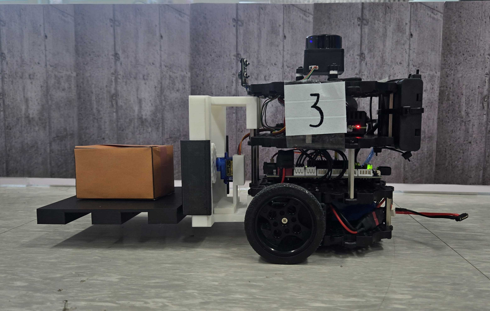
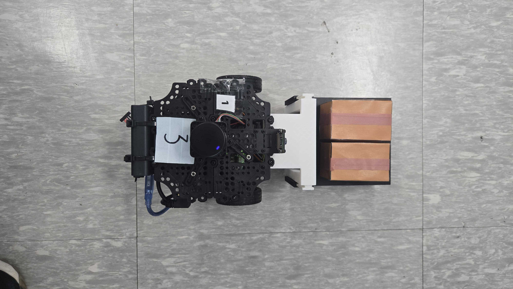
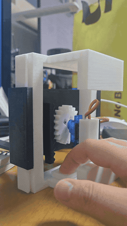

# 지게차 리프트 (3호기)

TurtleBot3 위에 3D 프린팅 랙앤피니언 마스트 + SG90 서보로 만든 경량 물품 리프트입니다.
관제 GUI의 수동조작 버튼으로 주행과 리프트를 함께 조작합니다.

<p align="center">
  
  
  <br><em>3호기 장착 모습 — 3D 프린팅 마스트·포크와 팔레트 적재</em>
</p>

<table>
  <tr>
    <td align="center" valign="bottom" width="50%">
      
    </td>
    <td align="center" valign="bottom" width="50%">
      
    </td>
  </tr>
  <tr>
    <td align="center" valign="top">
      <b>상자 운반 풀사이클</b><br>팔레트에서 상자를 실어 선반까지 (16배속)
    </td>
    <td align="center" valign="top">
      <b>랙앤피니언 리프트</b><br>벤치 구동
    </td>
  </tr>
</table>

## 구성

| 파일 | 내용 |
|---|---|
| `TB3_Forklift_Mast_Upper.stl` / `TB3_Forklift_Mast_Lower.stl` | 마스트 3D 프린팅 모델 |
| `pi_lift_servo.py` | Pi 상주 노드 — 서버 수동조작 릴레이 + 리프트 서보 구동 |

## 명령 경로

```
관제 GUI 버튼 → 서버 → /robot3/cmd_vel (TwistStamped, 도메인 4)
    ├─ linear.x / angular.z → /cmd_vel 릴레이 (주행)
    └─ linear.z             → GPIO18 PWM (+1 올림 / -1 내림 / 0 정지)
```

3호기는 카메라·라이다·Nav2 없이 수동조작 전용이라 PC측 노드가 0개입니다.
1·2호기에서 게이팅을 맡던 `manual_cmd_gate`는 patrol_commander의 state를 봐야 문을 여는데
3호기엔 그게 없으므로, 릴레이·0.5s 데드맨을 이 노드가 인수해 Pi 단독으로 동작합니다.
모션과 정지를 Pi 로컬에서 처리하는 이유는 WiFi 지연 시 '정지'가 늦으면
리프트가 기구 한계까지 밀고 올라가기 때문입니다.

## 개발 중 잡은 문제들

- **서보 과열** — "안 움직인다"는 것은 즉시 한계 신호. 명령을 더 보내면 체류시간이 발열을
  만든다. 이후 목표 도달 시 펄스를 끊는 방식으로 변경.
- **lgpio `tx_servo(..., 0)` 연속 호출 시 크래시** — 정지 명령 2회째에 라이브러리가 죽고
  PWM 라인이 LOW로 내려가지 않음. try/except + `gpio_write`로 라인을 직접 내려 우회.
- **하드웨어 PWM의 조용한 실패** — sysfs는 enable=1을 보고하는데 실제 펄스는 다른 핀에서
  나오는 상태. 서보 고장으로 오진할 뻔했고, 정상 동작하던 구성과 대조해 발견.
  이후 소프트웨어 PWM(lgpio)으로 통일.

## 실행

```bash
# 3호기 Pi에서 (lgpio는 비루트 실행 가능)
python3 pi_lift_servo.py
```
